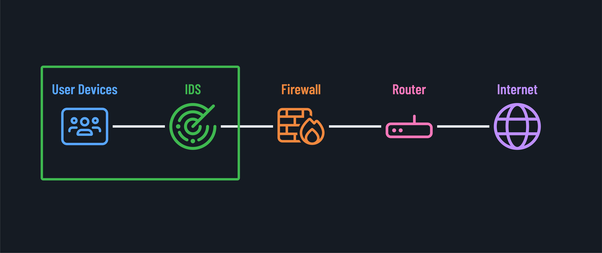
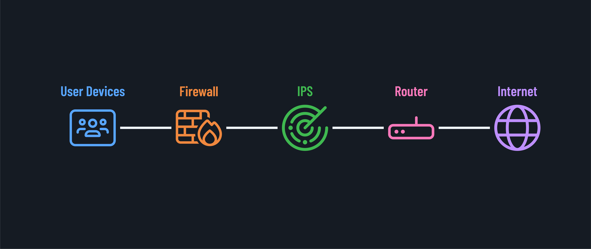

<h1>
  Foundational Network Security In-Depth
  Detecting Threats with IPS/IDS and SIEM Tools
</h1>

**Learning objective:** By the end of this lesson, students will be able to understand the role of intrusion prevention systems (IPS), intrusion detection systems (IDS), and security information and event management (SIEM) tools in network threat detection and analysis.

## Detecting threats

What happens when a threat makes it past the defenses we have in place? How do we detect and respond to potential intrusions in our network?

Enter intrusion detection systems, intrusion prevention systems, and security information and event management.

## Intrusion detection systems (IDS)

An IDS is a device or software application that monitors a network for malicious activity or policy violations.

When it detects a potential security breach, it logs the information and sends an alert to the administrator.

There are two main types of IDS:

- **Network intrusion detection systems (NIDS)**, which analyze network traffic.

- **Host intrusion detection systems (HIDS)**, which monitor activity on individual hosts.

## Intrusion prevention systems (IPS)

An IPS goes a step further. Like an IDS, it monitors network traffic for malicious activity. But instead of simply alerting an administrator, an IPS can also take immediate action to block the threat, for example, by dropping malicious packets, blocking traffic from the source address, or resetting connections.

You can think of an IDS as a smoke detector, alerting you to a potential fire, while an IPS is more like a sprinkler system, actively working to extinguish the fire.

## How IPS and IDS detect threats

IPS and IDS use a combination of signature-based detection (looking for patterns that match known threats) and anomaly-based detection (looking for deviations from normal traffic patterns).

They can help detect various threats, including malware, SQL injections, and DOS attacks.

## Security Information and Event Management (SIEM)

With the volume of data in modern networks, IPS and IDS can generate a massive number of alerts. This is where SIEM comes in.

SIEM (Security Information and Event Management) tools collect and analyze log data from various sources across an organization's IT infrastructure, including applications, hardware, and network equipment. The role of a SIEM is to provide a holistic, real-time view of an organization's security posture. By aggregating and correlating data from multiple sources, a SIEM can help identify trends, patterns, and anomalies that might indicate a security threat.

For example, imagine an attacker trying to log into multiple servers with incorrect credentials. Each login attempt might not trigger an IPS or IDS alert, but a SIEM could correlate these events and flag the pattern as suspicious.

SIEMs often use advanced analytics and machine learning to sift through the noise and prioritize the most critical threats. They can also automate certain response activities, like blocking an IP address or locking a user account.

In the context of network security, a SIEM can be a powerful tool for detecting and responding to threats that may have evaded other defenses. By giving security teams a centralized, real-time view of network activity, SIEMs can help speed up incident detection and response times.

Of course, implementing an effective SIEM is no small task. It requires careful planning, configuration, and ongoing tuning to ensure it's providing meaningful, actionable intelligence.
