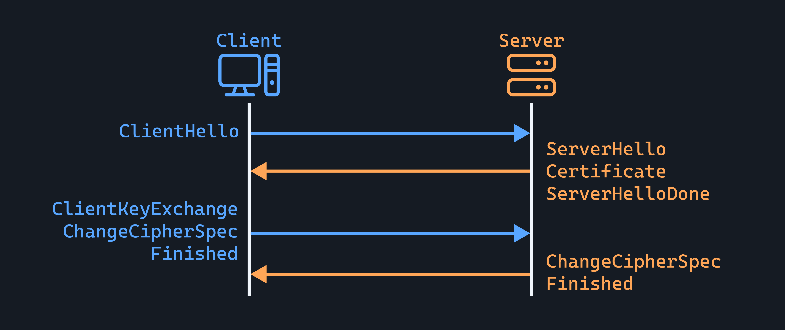
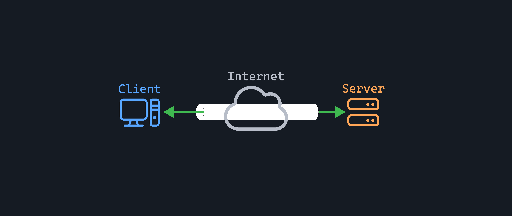

<h1>
  Foundational Network Security In-Depth
  Securing Data in Transit with SSL/TLS and IPSec
</h1>

**Learning objective:** By the end of this lesson, students will be able to understand how SSL/TLS and IPSec protocols secure data transmitted over networks and analyze their role in a defense-in-depth security strategy.

## SSL/TLS: Securing application-level communication

When we think about network security, one of our primary concerns is protecting the confidentiality and integrity of data as it travels across our networks. After all, what's the point of securing our servers and databases if an attacker can just intercept sensitive information while it's in transit?

This is where protocols like SSL/TLS and IPSec come in. Let's discuss SSL/TLS first.

SSL (Secure Sockets Layer) and its successor TLS (Transport Layer Security) are cryptographic protocols designed to provide secure communication over a computer network.

When you see that little padlock icon in your web browser, that's SSL/TLS in action.

**Here's how it works:**

- When a client (like your web browser) connects to a server (like a website) securely, they perform what's called an **SSL/TLS handshake**.

- During this handshake, the client and server agree on a cipher suite (a collection of algorithms they'll use to secure their communication) and exchange keys.

- The server also sends its SSL/TLS certificate, which verifies its identity.

- Once the handshake is complete, all data exchanged between the client and server is encrypted. This means that even if an attacker manages to intercept the data, they won't be able to read it without the encryption keys.

- SSL/TLS operates at the application layer, securing specific applications like web browsers, email clients, and messaging apps.

## IPSec: Securing network-level communication

But what if we want to secure all traffic between two points on our network, regardless of the application?

This is where IPSec comes in.

IPSec (Internet Protocol Security) is a protocol suite for securing IP communications by authenticating and encrypting each IP packet of a communication session.

IPSec operates at the network layer, meaning it can secure all applications above it. It's often used to implement VPNs (Virtual Private Networks), allowing remote users to securely connect to a private network over the public internet.

Like SSL/TLS, IPSec uses a handshake process to establish a secure connection. This involves negotiating security protocols, algorithms, and keys. Once the IPSec tunnel is established, all data sent through it is encrypted and authenticated.

Of course, SSL/TLS and IPSec aren't foolproof. They're only as secure as the keys and certificates used to implement them. Proper key management and regular certificate updates are crucial to maintain their effectiveness.

  <h2 class="title">Which protocol, where?</h2>
  5 min

Match each scenario listed below to:

- SSL/TLS
- IPSec
- or Both (if layered security would be appropriate)

The scenarios are:

1. A user logs into their bank via a web browser.
2. An employee connects to the company network from home using a VPN client.
3. Two backend servers in a data center exchange sensitive customer data.
4. An internal monitoring dashboard is accessed over HTTPS.
5. A remote office connects securely to HQ via a site-to-site VPN.
6. A mobile app fetches user data from an API hosted in the cloud.

Be prepared to explain your reasoning for each choice.
